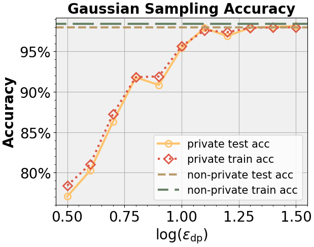

# DP NTK Regression

## 1 Environment Setup

You should install Pytorch by the following code
``` bash
# if you have a gpu, use the following command
pip install torch==1.13.1+cu117 torchvision==0.14.1+cu117 torchaudio==0.13.1 --extra-index-url https://download.pytorch.org/whl/cu117
# if you only have cpu on your machine, use the following command
pip install torch==1.13.1+cpu torchvision==0.14.1+cpu torchaudio==0.13.1 --extra-index-url https://download.pytorch.org/whl/cpu
```

Then, install other Python dependencies, using the following command
``` bash
pip install -r requirements.txt
```

## 2 Run DP NTK Regression on CIFAR10
Please refer to `run_dp_ntk_regression.ipynb`, 

where `ntk_utils.py` contains some useful function for computing $H^{\mathrm{dis}}$ and $\alpha$ in NTK Regression. 

After you run block by block in `run_dp_ntk_regression.ipynb`, you will find the last block is 
``` python
# you need to copy the output to gaussian_draw.ipynb to draw the figures.
print(eps_exponent_list)
print(draw_test_acc_list)
print(draw_train_acc_list)
```

When you run this block, you can get sth like the following
```
[0.5, 0.6, 0.7, 0.8, 0.9, 1.0, 1.1, 1.2, 1.3, 1.4, 1.5]
[0.7705000638961792, 0.8830000162124634, 0.8434999585151672, 0.9180000424385071, 0.9084998965263367, 0.9545000195503235, 0.9790000319480896, 0.9689998626708984, 0.9794999957084656, 0.9805000424385071, 0.981499969959259]
[0.7839500308036804, 0.8832500576972961, 0.8475000262260437, 0.9182001352310181, 0.9191500544548035, 0.9565500617027283, 0.9762499928474426, 0.9739500284194946, 0.9793000221252441, 0.9796000719070435, 0.9799000024795532]
```

where the first row denotes the eps's exponent. For example, the first entry 0.5 means we run DP NTK Regression with eps = $10^{0.5}$

the seconde row denotes the private test acc on CIFAT10 two classes classification task. 

the thirds row denotes the private train acc on CIFAT10 two classes classification task. 

## 3 Draw Figures

Please refer to `draw_figs.ipynb`, 

You should find the following code block in `draw_figs.ipynb`
``` python
x_data = [0.5, 0.6, 0.7, 0.8, 0.9, 1.0, 1.1, 1.2, 1.3, 1.4, 1.5]
test_acc_list = [0.7705000638961792, 0.8025, 0.8630, 0.9180000424385071, 0.9084998965263367, 0.9545000195503235, 0.9790000319480896, 0.9689998626708984, 0.9794999957084656, 0.9805000424385071, 0.981499969959259]
train_acc_list = [0.7839500308036804, 0.8103, 0.8726, 0.9182001352310181, 0.9191500544548035, 0.9565500617027283, 0.9762499928474426, 0.9739500284194946, 0.9793000221252441, 0.9796000719070435, 0.9799000024795532]

```

You should substitue the `x_data`, `test_acc_list` and `train_acc_list` with `eps_eponent_list`, `test_acc_list`, and `train_acc_list`, respectively. Then run the block, you can get the figure.




